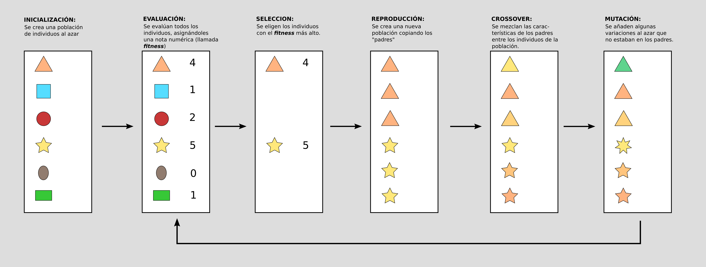
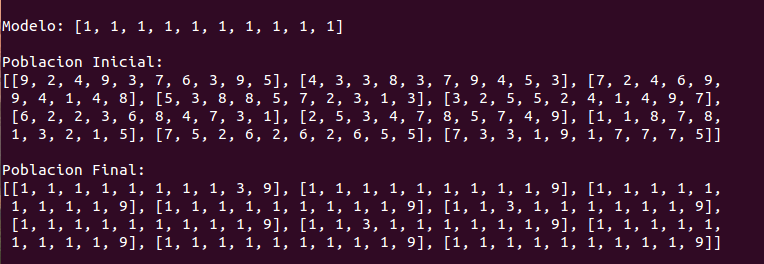
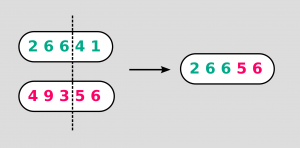

# 	Tutorial para programar un Algoritmo Genético
**Asignatura:** Aplicación de Nuevas Tecnologías
**Alumno:** Marcos Corvalán
**Fecha de entrega:** 9/11/18

## Introducción
En los años 1970, de la mano de John Henry Holland, surgió una de las líneas más prometedoras de la inteligencia artificial, la de los algoritmos genéticos. Son llamados así porque se inspiran en la evolución biológica y su base genético-molecular.
Estos algoritmos hacen evolucionar una población de individuos sometiéndola a acciones aleatorias semejantes a las que actúan en la evolución biológica (mutaciones y recombinaciones genéticas), así como también a una selección de acuerdo con algún criterio, en función del cual se decide cuáles son los individuos más adaptados, que sobreviven, y cuáles los menos aptos, que son descartados.
Los algoritmos genéticos se utilizan para solucionar problemas de optimización que de otra forma serían difíciles para un diseñador humano. En vez de una población de gacelas que debe desarrollar características que le permitan sobrevivir, tienes un conjunto de soluciones para un problema a resolver. Se llama población al conjunto de soluciones e individuo a cada una de las soluciones. El algoritmo evalúa cada una de las soluciones y selecciona las que mejor resuelven el problema.
La estructura de un Algoritmo Genético es un proceso iterativo que puede resumirse en 6 etapas:

## Tutorial
El mismo consistirá en como programar en python un algoritmo que permita hacer evolucionar una “especie” de **arrays**
Tenemos un array de números enteros que será el **modelo**. Cada **individuo** de la **población** será también un array de enteros, inicialmente generados al azar. Cuánto más parecido al modelo sea un individuo, mayor será su **fitness**.
El algoritmo seleccionará los individuos más parecidos al modelo para su **reproducción**. Así, el algoritmo conseguirá que la población se acerque más al modelo en cada generación.

**Paso 1:**
Lo primero son las declaraciones.
```python
import random
modelo = [1,1,1,1,1,1,1,1,1,1]
#Objetivo a alcanzar
largo = 10
#La longitud del material genetico de cada individuo
num = 10
#La cantidad de individuos que habra en la poblacion
pressure = 3
#Cuantos individuos se seleccionan para reproduccion. Necesariamente mayor que 2
mutation_chance = 0.2
#La probabilidad de que un individuo mute
print("\n\nModelo: %s\n"%(modelo))
#Mostrar el modelo, con un poco de espaciado
```
La primera línea llama la librería **random**, que va a ser necesaria para generar una **población** inicial, cruzar los **individuos**, etc.
El array **‘modelo‘** es, como su nombre indica, el modelo a imitar. Las crudas leyes de la selección artificial dejarán vivir sólo a aquéllos que se parezcan más a este modelo. Aunque es probable que la población no llegue nunca a ser idéntica al modelo. Esto se debe a que la evolución es un proceso semi aleatorio.
La variable **‘largo‘** es la longitud de cada individuo, y **‘num‘** define la dimensión de la población.
**‘pressure‘** dice la cantidad de **individuos** que se seleccionan para la **reproducción**. Necesariamente tiene que ser mayor de 2. En este programa seleccionará tres **individuos**. Si quisiera ser riguroso y seguir las convenciones, la variable de **presión** debería estar en porcentaje (un 0.3 equivaldría a seleccionar un 30% del total de individuos), pero he pensado que de esta otra forma es más fácil de entender.
La variable **‘mutation_chance‘** establece la probabilidad de que un **individuo** sufra una mutación durante la fase de **reproducción**. Como dije en la primera parte, es necesario que haya **mutaciones** para poder explorar nuevas soluciones que no pueden obtenerse combinando el material genético de los padres.
**Paso 2:**
Ahora vienen tres funciones básicas. La primera crea un **individuo** que después será guardado dentro de una matriz llamada **“población”**, junto al resto de **individuos**:
```python
def individual(min, max):
    """
        Crea un individual
    """
    return[random.randint(min, max) for i in range(largo)]
```
Recibe como parámetros dos números enteros (un **mínimo** y un **máximo**) y se llena una lista de longitud dada por la variable **‘largo‘** con números aleatorios entre el mínimo y el máximo. Esta lista creada será el nuevo **individuo**.
La siguiente función sirve para crear una **población**:
```python
def crearPoblacion():
    """
        Crea una poblacion nueva de individuos
    """
    return [individual(1,9) for i in range(num)]
```
Llama la función para crear individuales un número de veces igual a **‘num‘**, que definía el tamaño de la **población**. Todos estos nuevos **individuales** los guarda dentro de una lista, que devuelve fuera de la función.
La tercera es la **función de fitness**. Dado un individuo, la función **comprueba cuántos números tiene en común con el modelo** y le **asigna el fitness** correspondiente. Después devuelve este número fuera de la función.
```python
def calcularFitness(individual):
    """
        Calcula el fitness de un individuo concreto.
    """
    fitness = 0
    for i in range(len(individual)):
        if individual[i] == modelo[i]:
            fitness += 1
  
    return fitness
```
Esto eran las funciones básicas.
**Paso 3:**
La **inicialización** ya está hecha (es la función **crearPoblación**). Ahora vamos a usar una función que llamaré **selection_and_reproduction**() para evaluar cada uno de los individuos (**evaluación**), seleccionar los mejores (**selección**) y mezclar su material genético (**crossover**) a fin de crear una nueva **población** encima de la anterior.
```python
def selection_and_reproduction(population):
    """
Puntua todos los elementos de la poblacion (population) y se queda con los mejores guardandolos dentro de 'selected'. Despues mezcla el material genetico de los elegidos para crear nuevos individuos y llenar la poblacion (guardando tambien una copia de los individuos seleccionados sin modificar).
  
Por ultimo muta a los individuos.
    """
    puntuados = [ (calcularFitness(i), i) for i in population] #Calcula el fitness de cada individuo, y lo guarda en pares ordenados de la forma (5 , [1,2,1,1,4,1,8,9,4,1])
    puntuados = [i[1] for i in sorted(puntuados)]
#Ordena los pares ordenados y se queda solo con el array de valores
    population = puntuados  
    selected =  puntuados[(len(puntuados)-pressure):]
#Esta linea selecciona los 'n' individuos del final, donde n viene dado por 'pressure'
#Se mezcla el material genetico para crear nuevos individuos
    for i in range(len(population)-pressure):
        punto = random.randint(1,largo-1)
#Se elige un punto para hacer el intercambio
        padre = random.sample(selected, 2) #Se eligen dos padres  
        population[i][:punto] = padre[0][:punto]
#Se mezcla el material genetico de los padres en cada nuevo individuo  
    return population
#El array 'population' tiene ahora una nueva poblacion de individuos, que se devuelven
```
La primera parte **ordena los individuos** de la población de menor a mayor fitness. Después **selecciona los mejores**, que serán los últimos del array ordenado. Por último, **mezcla el material genético** de los padres para crear los nuevos individuos, de la forma que expliqué en la primera parte del tutorial: **se elige un punto al azar y se intercambia el material genético de los padres a partir de esta posición.**

**Paso 4:**
También es necesaria una **función de mutación**, que **añada pequeñas variaciones al azar** en el array de los individuos de la nueva generación.
```python
def mutation(population):
    """
Se mutan los individuos al azar. Sin la mutacion de nuevos genes nunca podria
alcanzarse la solucion.
    """
    for i in range(len(population)-pressure):
        if random.random() <= mutation_chance:
#Cada individuo de la poblacion (menos los padres) tienen una probabilidad de mutar
            punto = random.randint(0,largo-1)
#Se elgie un punto al azar
            nuevo_valor = random.randint(1,9)
#y un nuevo valor para este punto
#Es importante mirar que el nuevo valor no sea igual al viejo
            while nuevo_valor == population[i][punto]:
                nuevo_valor = random.randint(1,9)
#Se aplica la mutacion
            population[i][punto] = nuevo_valor  
    return population
```
Para acabar, se crea una población inicial y el bucle del programa. El algoritmo hará evolucionar a la población durante cien generaciones, llamando las funciones que se han definido arriba:
```python
population = crearPoblacion()
#Inicializar una poblacion
print("Poblacion Inicial:\n%s"%(population))
#Se muestra la poblacion inicial 
#Se evoluciona la poblacion
for i in range(100):
    population = selection_and_reproduction(population)
    population = mutation(population) 
print("\nPoblacion Final:\n%s"%(population))
#Se muestra la poblacion evolucionada
print("\n\n")
```
El tutorial ha llegado a su fin. Espero sea comprensible y de utilidad.
